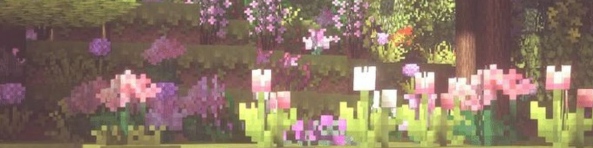

# MINICRAFT: Word Resource Finder

⊹ A simple Word Analyzer tool turned into a mini-game inspired by Minecraft. Words are mysterious blocks that are mined to unveil their rarity and discover hidden resources! 

## Features

★ Words mimic as blocks.  
★ Player mines the block using a tool. 
★ The blocks breaks into compnonents like resource, fragments, crystals. 
★ Based on the word analysis, rarity reveals. 

## How this works

✦ The player enters a word. 
✦ The length of the word (block) determines how hard it is to break. The lengthier the word, harder it is to break. 
✦ Fragments are consonants and crystals are vowels here. Consonants and vowels are analysed separately. 
✦ The rarity depends upon the uniqueness of the word.  
✦ The unique factor depends on how many letters only appear once in the word. More of those letters will increase the rarity. 
✦ A mined resource report is presented at the end (basically a word analysis report), the resource is revealed. 

## Resource Tiers

### Common
- Dirt
- Sand
- Wood
- Gravel
- Clay
- Snow

### Uncommon
- Iron
- Copper
- Redstone
- Nether Quartz

### Rare
- Gold
- Diamond
- Emerald
- Obsidian

## Concepts Used

▪ Functions  
▪ Dictionaries 
▪ Loops 
▪ Conditional Statements 
▪ String Manipulation 
▪ Random Module 

## Author's Purpose

It had been a month since I created something in Python (due to DSA , C++) and wanted to take a simple project but, add a twist to it. I used to play Minecraft a few years ago, this was a good chance to convert a simple project into a game-based mini project inspired by a Minecraft. (Well, atleast a section of it.)

I may add more features/changes to it later on. Till then enjoy!
(if you like it, do give it a star ⛥) 
~ SWATI

## PREVIEW

